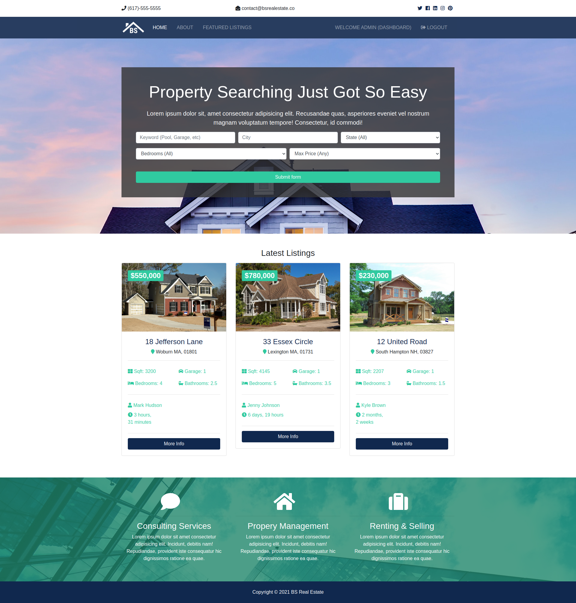

### 🚀 Introduction

> Web project using Python (Django). Simulates a real estate company; search for your property!

---

</br>
<div align=center margin= auto> 
  
</div>

---

### Technologies

- django 3.1.6.
- python 3.9.1
- sqlite3
- black (code formatting)
- pycodestyle
- bootstrap 4.4.1 (custom)

### Install

```shell
pip install -r requirements.txt
```

### Run

Change into the outer **bsre** directory, if you haven’t already, and run the following commands:
```python
python manage.py runserver
```

Now that the server’s running, visit http://127.0.0.1:8000/ with your Web browser. 

### TODO

> Send e-mail to realtors
